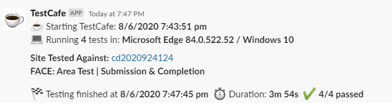

# TestCafe Reporter Slack for face-ui-test

### testcafe-reporter-slack

This is a reporter for [TestCafe](http://devexpress.github.io/testcafe). It sends the output of test(s) to [Slack](https://slack.com/).

## Purpose :dart:

Once configured the reporter sends test results to Slack channel, e.g.

**SUMMARY logging level output reports**




## Installation :construction:

Install this reporter as your test project dependency (already done in `face-ui-test`):

```bash
npm i testcafe-reporter-slack --save
```

## Modifying the reporter:

Any changes made in the `src` directory need to be processed and outputted to `lib` using `npm run build`—which will use the methods defined in `Gulpfile.js` for the build.

It's recommened you `npm link` this repo to the `face-ui-test` repo when developing locally. Remember to `npm run build` everytime you make changes to the reporter.

## Setup instructions :wrench:

In order to use this TestCafe reporter plugin, it is necessary to add it as your reporter to your TestCafe.

### Using `.testcaferc.json` config file

Add a reporter name (`slack`) to your `reporter` object:

```json
{
  "browsers": ["chrome"],
  "reporter": [
    {
      "name": "slack"
    },
    {
      "name": "spec"
    }
  ]
}
```

### If using TestCafe API

Pass the reporter name (`slack`) to the `reporter()` method:

```js
testCafe
  .createRunner()
  .src("path/to/test/file.js")
  .browsers("chrome")
  .reporter("slack") // <-
  .run();
```

### Necessary configuration

After that, you should define a **.env** file with variables for your Slack reporting. This should placed in folder from where you call TestCafe from (the root directory).

```dotenv
# .env
TESTCAFE_SLACK_WEBHOOK=https://hooks.slack.com/services/*****
TESTCAFE_SLACK_CHANNEL=#channel-name
```

This is the **required minimum to have it working**.

## Options :gear:

This Slack reporter has a few options which could be configured from both, `.testcaferc.json` or `.env` file as global variables.
**It will first retrieve the values from the TestCafe config file `.testcaferc.json`**, after that from `.env` file.

- :warning: - **required**
- :balloon: - optional
- :link: - deprecated

#### Slack Webhook URL :warning:

**This option is required!** Your Slack channel webhook URL generated from Slack API to allow reporter post there.
It's **not recommended** to pass your `webhookUrl` into the config file, in this case, due to sensitive data, it's **better to pass it via global variable** in `.env` file.

- via `.testcaferc.json`

```json
{
  "name": "slack",
  "options": {
    "webhookUrl": "https://hooks.slack.com/services/*****"
  }
}
```

- via `.env` file

```dotenv
# .env
TESTCAFE_SLACK_WEBHOOK=https://hooks.slack.com/services/*****
```

#### Username :balloon: :link:

Your Slack app username.

- via `.testcaferc.json`

```json
{
  "name": "slack",
  "options": {
    "username": "testcafebot"
  }
}
```

- via `.env` file

```dotenv
# .env
TESTCAFE_SLACK_USERNAME=testcafebot
```

#### Logging level

Choose your report logging level: 
- `SUMMARY` Show only number of tests which passed, failed and was skipped
- `TEST` Show report of tests that passed and failed
- `DEBUG` Show each test with error stack trace for failed tests

- via `.testcaferc.json`

```json
{
  "name": "slack",
  "options": {
    "loggingLevel": "SUMMARY"
  }
}
```

- via `.env` file

```dotenv
# .env
TESTCAFE_SLACK_LOGGING_LEVEL=SUMMARY
```

#### Quiet mode

Choose if you want to have messages in the terminal about sending specific messages to Slack, it's turned off by default.

- via `.testcaferc.json`

```json
{
  "name": "slack",
  "options": {
    "quietMode": true
  }
}
```

- via `.env` file

```dotenv
# .env
TESTCAFE_SLACK_QUIET_MODE=true
```

## Further Documentation :books:

[TestCafe Reporter Plugins](https://devexpress.github.io/testcafe/documentation/extending-testcafe/reporter-plugin/)
